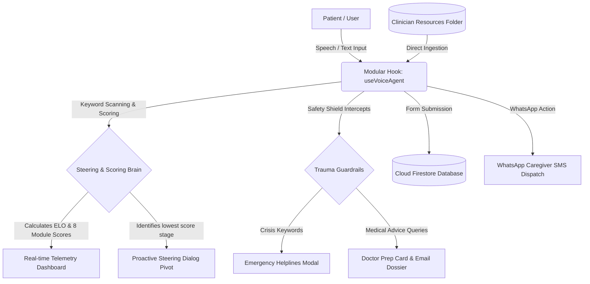

# Technical Specification: BCF Hope Companion (Axiom Hope)
## Version 1.0.0 // BeTwin Singapore Outpatient Support Platform

This document outlines the architecture, data models, state machines, and integration guidelines for the **BCF Hope Companion (Axiom Hope)**. It has been compiled specifically to guide visual integration by developers (JO) and clinical updates by medical researchers (Rachel).

---

## 1. System Architecture

Axiom Hope operates as a decoupled, hook-based conversational agent. The frontend visual layer acts as a stateless shell, binding directly to our stateful modular hook, telemetry dashboard, and clinical resources registry.



---

## 2. Core API Reference: `useVoiceAgent` Hook
All speech streaming, local natural fallbacks, state telemetry, and action triggers are encapsulated inside `src/hooks/useVoiceAgent.js`. 

### State Variables
| State Name | Type | Description |
| :--- | :--- | :--- |
| `elo` | `Number` | Patient's emotional resilience score. Default starts at `1000`. |
| `activeModule` | `String` | Key of current active stage (e.g. `'jargon'`, `'screening'`, etc.). |
| `voiceState` | `String` | State of voice session (`'idle'`, `'listening'`, `'thinking'`, `'speaking'`). |
| `subtitles` | `String` | Teletype spoken dialog transcript or listening indicator. |
| `speechAmplitude` | `Number` | Dynamic vocal physics amplitude (0.0 to 1.0) for visualizer spheres. |
| `moduleScores` | `Object` | Key-value mapping of progress percentages (0-100) for all 8 stages. |
| `crisisTriggered` | `Boolean` | Flag that blocks the session and displays local Singapore helpline numbers. |
| `user` | `Object` | Secure GovTech Singpass authenticated profile payload. |
| `caregiverAuthorized`| `Boolean` | Caregiver WhatsApp updates authorization slider state. |
| `biggerSisterMatched`| `Object` | Profile details of matched BCF remission survivor peer. |

### Exposed Methods
*   `startAgentSession()`: Awakens Axiom Hope. Initiates ElevenLabs WebRTC socket streaming, falling back safely to local high-quality system voices with pacing slowing (0.88x speed).
*   `endAgentSession()`: Gracefully halts all WebRTC and local synthesizers and sets session to standby.
*   `switchModule(moduleKey)`: Programmatically pivots the conversation focus to a specific BCF stage.
*   `submitUserInput(text)`: Triggers the conversational analyzer, processing typed symptoms or concerns.
*   `handleBCFSubmit(e)`: Form handler that initiates a simulated Singpass EHR sync teletype process and pushes Care Journal data to Cloud Firestore.
*   `matchBiggerSister()`: Triggers BCF peer sister matching search, returning survivor bios and Whatsapp links.
*   `dispatchDoctorEmail()`: Assembles the patient notes and discussion questions, pre-filling a native email to their oncologist.

---

## 3. Proactive Steering & Keyword Scoring Engine

When a patient speaks or types an answer, the input string undergoes clean lower-casing and keyword matching against the **8 lifecycle stages** configured by the clinician:

$$\text{Active Stage score} \leftarrow \min(100, \text{Active Score} + 40\%)$$
$$\text{Matched Stage score} \leftarrow \min(100, \text{Stage Score} + [\text{Keyword Matches} \times 20\%])$$

### Conversational Next-Stage Steering Algorithm
At the end of each dialogue transaction, the hook calculates the patient's journey profile:
1. Loops through the 8 stages in chronological order.
2. Identifies the stage with the **lowest score**.
3. If the lowest score is $< 50\%$, Axiom Hope **proactively steers** the dialogue to that untouched or low-scoring stage on its next spoken reply.
4. E.g., pivot phrase: *"I have securely logged your side effects. Looking at your journey profile, we haven't discussed Stage 5: Fertility Preservation yet. What questions do you have about egg freezing before starting treatment?"*

---

## 4. Trauma-Informed Clinical Guardrails

### A. Emergency Crisis Safeguard
- **Triggers**: `"suicide"`, `"kill myself"`, `"want to die"`, `"self harm"`, `"harm myself"`, `"hopeless"`.
- **Action**: Activates `crisisTriggered = true`, speaking an immediate comforting redirection and locking the interface.
- **Routing**: Presents verified, clickable Singapore emergency helplines:
  - **Samaritans of Singapore (SOS)**: `1767` (24/7)
  - **Institute of Mental Health (IMH)**: `6389 2222` (24/7)
  - **BCF Singapore Support Circle**: `6352 6560`

### B. Medical Advice Interceptor
- **Triggers**: `"change my drugs"`, `"stop my chemo"`, `"diagnose this"`, `"what pill"`.
- **Action**: Empathetically explains that Axiom is an emotional companion, not a practicing oncologist.
- **Action**: Automatically transcribes and appends the query to `clinicalQuestions` so the patient is fully prepared to raise it with their doctor at their next consultation.

---

## 5. Clinician Resources Folder (`resources/`)

Designed specifically for Rachel the clinician to maintain medical directories without touching front-end React files:
*   **Location**: `resources/clinical_resources.json`
*   **Configurable Data**:
    - **`bcf_guidelines`**: Links and support groups.
    - **`emergency_helplines`**: Hotline phone numbers and descriptions.
    - **`oncology_hospital_directories`**: Public/private hospital websites and addresses in Singapore.
    - **`clinical_symptom_formulas`**: Clinical LaTeX math representations.

---

## 6. Developer Integration Guide (For JO)

To map our brain and scoring logic into any visual UI layout, JO only needs to import the modular hook:

```javascript
import useVoiceAgent from './hooks/useVoiceAgent';
import WolframConsole from './components/WolframConsole';

export default function MyDesignShell() {
  const agent = useVoiceAgent();

  return (
    <div className="soothing-grid">
      {/* 1. Awaken Beacon */}
      <button onClick={agent.startAgentSession} className={agent.voiceState}>
        {agent.voiceState === 'listening' ? 'Listening...' : 'Start Session'}
      </button>

      {/* 2. Visual Subtitle Feed */}
      <p className="subtitles">{agent.subtitles}</p>

      {/* 3. Progress Meters */}
      <div className="meters-container">
        {Object.keys(agent.moduleScores).map(key => (
          <div key={key} className="progress-bar">
            <span>{key}: {agent.moduleScores[key]}%</span>
            <div style={{ width: `${agent.moduleScores[key]}%` }} />
          </div>
        ))}
      </div>

      {/* 4. Wolfram Diagnostics Console */}
      <WolframConsole 
        activeRiddleId={1} // Map stage ID
        voiceState={agent.voiceState}
        moduleScores={agent.moduleScores}
      />
    </div>
  );
}
```
